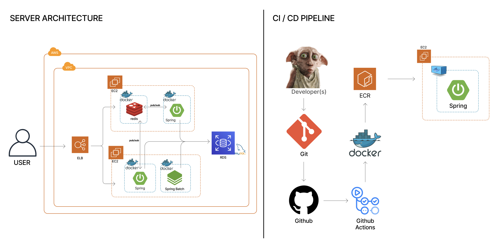
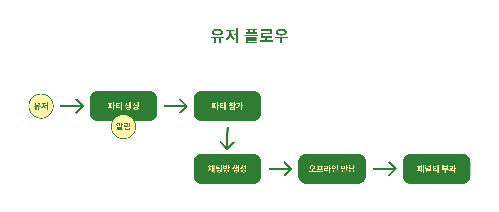
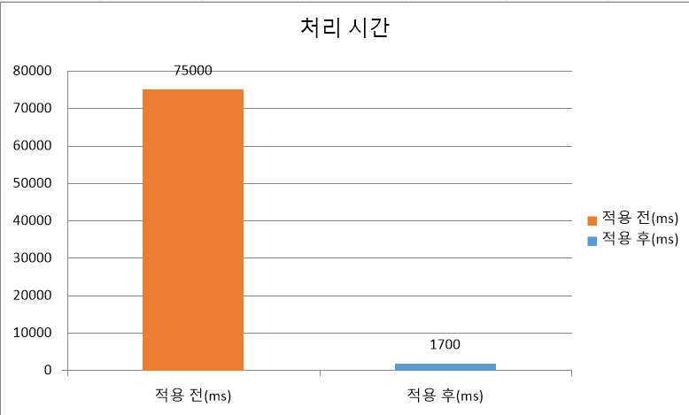
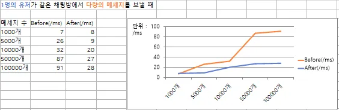
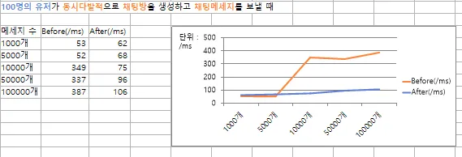
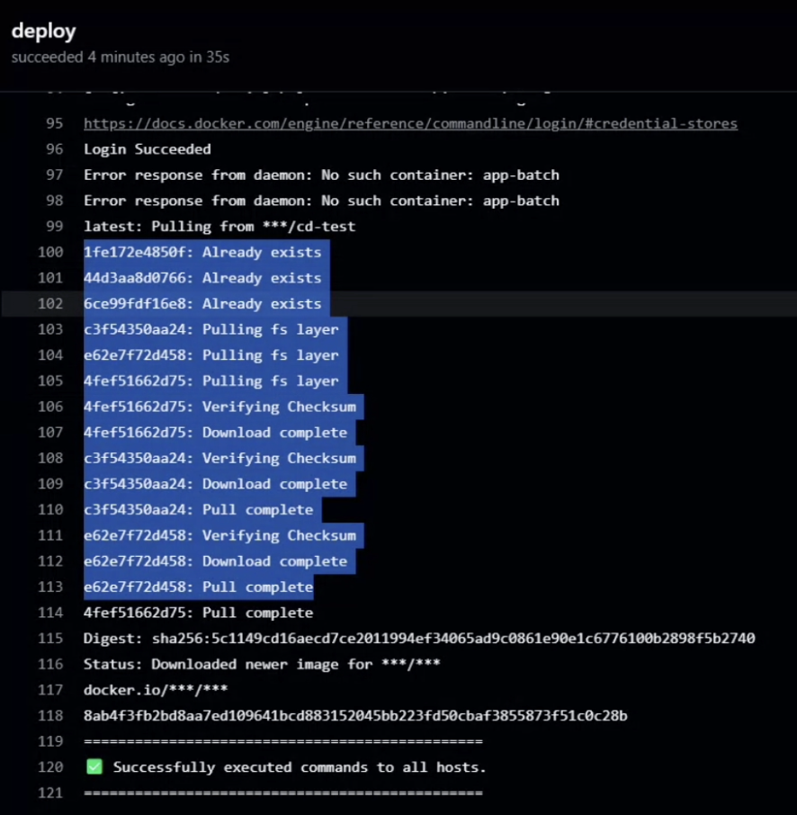
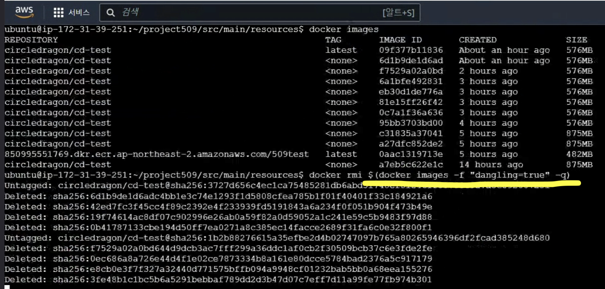
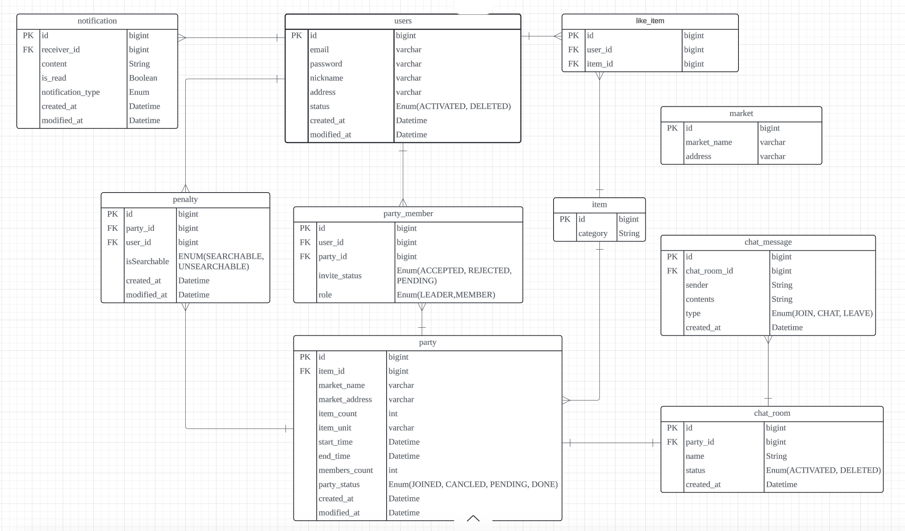

## Project 5.0.9 : 오프라인 공동 구매 플랫폼 Offline Group-Buy Platform

 

## 🏁 프로젝트 기획 및 소개

- 내 주변 오프라인 마트에서 물품의 공동구매를 원하는 소비자들을 모아주는 플랫폼
- 빠른 시간 내에 소량 구매를 원하는 소비자가 타겟인 서비스

## 🎈 인프라 설계도

## 🔑 주요 기능

> * 파티 - 공동구매를 목적으로 만들어지는 모임
> * 채팅 - 파티에 가입된 사람들끼리 실시간 채팅
> * 알림 - 유저가 찜 해 둔 특정 마켓 및 품목에 대한 알림과 파티의 생성 및 취소 알림, 채팅 생성 알림
> * 품목 - 공공데이터 API 를 사용해 품목 리스트를 생성
> * 마켓 - 실제 도로명 주소를 기반으로 위도 / 경도 데이터를 활용해 내 주변 파티의 목록과 거리를 조회
> * 페널티 - 파티의 리더는 오프라인 파티 미참석 유저에게 페널티를 부여

## 🕹️ 프로젝트 핵심기능

### 🔔 채팅

> * WebSocket 과 STOMP 를 사용하여 실시간 채팅기능 구현
> * 사용자가 채팅방 입장 시, 입장 전 오갔던 메세지 확인 가능

### 🔔 알림

> * 이벤트 발생시 SSE 를 이용하여 실시간, 지속적인 알림 기능 제공
> * 단방향 서비스를 제공하여 리소스 부담이 적고 구현이 간단

### 🔔 품목 업데이트

> * 더미 데이터가 아닌 공공데이터를 통해 실제 사용되는 품목 데이터를 이용
> * Spring Batch 와 Webclient 를 통해 데이터를 동기 방식으로 병렬 처리

## 📝 Technologies & Tools 📝

> * Language & Framework & Library

     

> * Database

  

> * Infrastructure & CI / CD

   

> * Message Queue

 

## 📯기술적 의사결정

>### 공공데이터 파싱을 위한 의사결정 Spring batch / WebClient
- 성능 개선 사항
- 기존 동기/직렬방식의 API 요청 데이터 처리방식을 Spring batch / WebClient 을 활용한 비동기/병렬방식으로 변경하여 성능개선
- 10,000 건 데이터 기준 테스트 결과 : 1분 15초 → 1.7초로 97% 개선
   
       
      

- 요구사항 : 정형화된 품목 카테고리 필요
- 기술결정 : WebClient를 통해 API 요청을 보내고 받아온 데이터를 비동기 처리 & 데이터 파싱 및 DB 저장은 Spring batch를 활용

  
대안비교

  <ul>
    <li>WebClient
      <ul>
        <li>장점: 싱글 스레드 기반의 비동기방식으로 동작해 적은 자원사용과 높은 효율</li>
        <li>단점: 이벤트루프기반의 비동기 동작하기 때문에 어려운 디버깅 추적</li>
      </ul>
    </li>
    <li>RestTemplate
      <ul>
        <li>장점: Spring의 여러 기능들과 통합 용이, 직관적인 API 제공</li>
        <li>단점: 동기식 처리로 대용량 처리시 병목현상 발생, 비동기 환경에서는 블로킹으로 인한 성능 제한</li>
      </ul>
    </li>
    <li>OpenFeignClient
      <ul>
        <li>장점: HTTP 요청의 로직을 구현할 필요 없이 단순히 메서드를 정의, HTTP 요청 헤더나 파라미터 등을 쉽게 수정</li>
        <li>단점: 제한된 설정으로 제한된 성능최적화, Spring Cloud 라이브러리와의 통합이 필요</li>
      </ul>
    </li>
  </ul>

> ### 다중서버 채팅 동기화

- 성능개선 사항
    - 상황 1 - 1명의 유저가 같은 채팅방에서 다량의 메세지를 보낼 때 채팅 메시지 전송 속도 평균 45% 개선
      

    - 상황 2 - 100명의 유저가 동시다발적으로 채팅방을 생성하고 채팅메세지를 보낼 때 채팅 메시지 전송 속도 평균 34% 개선
      

- 요구사항 : 다중서버에서 채팅 동기화를 위한 외부 메세지 브로커를 구현 필요
- 기술결정 : 채팅 메세지에 고도화된 기능이 필요하지 않기 때문에, 소규모이며 실시간 응답성이 가장 빠른 Redis로 선택

  
대안비교

  <ul>
    <li>Redis : 소규모 또는 간단한 채팅 기능 구현에 적합
      <ul>
        <li>장점 : 성능이 빠르며 설정, 사용이 간단하며 Pub/Sub 메커니즘으로 실시간 통신에 적합</li>
        <li>단점 : 메세지 저장 기능이 없고, 대규모 서비스에서는 확장성 제한</li>
      </ul>
    </li>
    <li>RabbitMQ : 안정적이고 지속 가능한 메세지 저장과 복잡한 라우팅이 필요한 경우에 적합
      <ul>
        <li>장점 : 복잡한 메세지 라우팅이 가능하고, 큐 기반으로 메세지 영구 저장이 가능, AMQP 프로토콜을 사용하여 안정성과 신뢰성이 높음</li>
        <li>단점 : Redis에 비해 설정, 관리가 복잡하고 상대적으로 성능이 느린 경우 존재, 높은 처리량이 필요한 대규모 환경에서는 추가적인 성능 튜닝이 필요</li>
      </ul>
    </li>
    <li>Kafka : 매우 높은 트래픽과 데이터 영속성, 분석이 필요한 대규모 환경에 적합
      <ul>
        <li>장점 : 대용량 데이터 처리에 최적화되어 있으며 높은 처리량과 내결함성을 제공, 메시지 영구 저장 및 복구가 가능하고 분산 시스템으로 스케일링이 쉬움</li>
        <li>단점 : 설정과 운영이 가장 복잡하며, 메시지 지연(latency)이 Redis와 RabbitMQ에 비해 높은 편</li>
      </ul>
    </li>
  </ul>

> ### Redis 캐싱을 이용한 페널티 집계값 조회 성능 개선

- 성능 개선 사항
- 평균 응답 시간 2% 감소, 최대 응답 시간 52% 감소
- 표준 편차 22% 감소, 초당 처리 요청 수 2% 증가
    - 전후 비교
       
      
- 요구사항 : DB 데이터의 조회가 반복될 경우 성능 저하로 인해 응답 속도나 서버 부하에 문제가 생길 수 있다고 판단
- 기술결정 : 조회 빈도가 높은 유저의 페널티 집계값을 빠르고 원활하게 조회하려면 Redis 캐싱이 성능의 최적화에 유리할 것이라고 판단

  
대안비교

  <ul>
    <li>RDBMS ( 데이터베이스 )
      <ul>
        <li>장점: 데이터의 일관성을 보장하기 위한 트랜잭션을 지원하는 등의 특징</li>
        <li>단점: 캐싱이 아닌 DB의 직접적인 조회는 데이터의 사이즈가 커진 서비스의 성능과 확장성 면에서 비효율적</li>
      </ul>
    </li>
    <li>Memcached
      <ul>
        <li>장점: 메모리 기반 캐시로, 단순한 키-값 저장소로 자주 쓰임, 캐시된 데이터의 만료 시간 설정도 가능</li>
        <li>단점: Redis에 비해 기능이 제한적이고 데이터가 비영속적</li>
      </ul>
    </li>
    <li>Redis
      <ul>
        <li>장점: 트래픽이 많고 조회 빈도가 높은 유저의 페널티 집계값을 빠르고 원활하게 조회하려면 Redis 캐싱이 성능의 최적화와 빠른 속도, 유연성 면에서 유리할 것이라고 판단</li>
        <li>단점: 설정과 운영이 가장 복잡하며, 메시지 지연(latency)이 Redis와 RabbitMQ에 비해 높은 편</li>
      </ul>
    </li>
  </ul>

> ### CI/CD 파이프라인 구축

- 요구사항 : CI/CD 파이프라인을 구축하기 위해 적합한 도구를 선정
- 기술결정 : GitHub Actions이 GitHub와의 통합이 매끄럽고 설정이 간단해 더 효율적이라고 판단

  
대안비교

  <ul>
    <li>Github Actions
      <ul>
        <li>장점: GitHub과 연동되어 있어 설정이 간편, GitHub Marketplace에 있는 액션 활용가능으로 비용이 효율적, GitHub 기반 프로젝트에 최적화</li>
        <li>단점: 복잡한 파이프라인을 구현하기 힘듦, 작업 커스터마이징이 어려움</li>
      </ul>
    </li>
    <li>Jenkins
      <ul>
        <li>장점: 높은 유연성과 확장성을 제공, GitHub 외의 다양한 버전 관리 시스템과 연동가능</li>
        <li>단점: 자체 서버 설치 및 운영이 필요하므로 유지 관리 비용이 증가, 초기 설정이 GitHub Actions보다 복잡</li>
      </ul>
    </li>
  </ul>

> ### 알림 데이터의 실시간 동기화

- 요구사항 : 사용자 경험을 향상시키기 위해 빠르고 안정적으로 데이터 전달 필요
- 기술결정 : 서버에서 클라이언트로만 데이터 푸시가 필요한 경우에 적합하고, 사용자가 적은 리소스로 연결을 유지하기 때문에 SSE 방식 선택

  
대안비교

  <ul>
    <li>WebSocket
      <ul>
        <li>장점: 클라이언트와 서버 간에 양방향 통신이 가능한 지속적인 연결을 제공</li>
        <li>단점: 구현이 복잡하고 높은 리소스를 소모</li>
      </ul>
    </li>
    <li>Long Polling
      <ul>
        <li>장점: 클라이언트가 서버에 데이터를 요청하면, 서버는 즉시 응답을 보내지 않고 데이터가 준비될 때까지 대기 상태를 유지. 양방향 통신이 가능하고 실시간 데이터 처리가 가능.</li>
        <li>단점: 빈번한 연결과 응답을 반복하여 서버 부하가 증가</li>
      </ul>
    </li>
    <li>SSE
      <ul>
        <li>장점: 서버 리소스 소모 적음, Keep-Alive로 연결 유지 비용 낮음, 단순하고 간편한 구현</li>
        <li>단점: 바이너리 데이터 전송 제한, 단방향 통신</li>
      </ul>
    </li>
  </ul>

> ### 알림 SSE (작성 예정)

## ❓ 트러블 슈팅 Trouble Shooting

> ### CORS 정책 충돌

- 문제상황
    - WebSocket 에서 설정된 allowCredentials(true)로 인해, 특정 자격 증명이 있는 요청만 허용하도록 설정
    - 하지만 setAllowedOrigins("*")이 모든 자격 증명이 있는 요청을 허용하기 때문에 CORS 정책 충돌 발생
- 해결방안
    - setAllowedOriginPatterns(allowedOrigin)으로 수정함으로써, 정책 충돌 해결 및 특정 도메인 주소를 지정함으로써 보안 강화

> ### API 요청 데이터 제한 & 처리지연

- 문제상황
    - API 서버에서 데이터 요청 회당 1000건 제한으로 여러 번의 요청이 필요, 직렬 동기 처리로 병목현상 발생
    - 데이터 파싱과 DB 저장시 처리시간 지연
    - 중복 검증 단계에 MySQL DB 접근으로 처리시간 지연
- 해결방안
    - API 요청 라이브러리 RestTemplate 에서 WebClient 로 변경하여 요청을 동기 방식에서 비동기 방식으로 변경
    - Spring Batch 도입해 데이터 파싱과 DB 저장을 청크로 묶어 병렬처리
    - 데이터 중복 확인을 위해 검색이 빠른 Hash Set 자료구조 이용

> ### CI / CD 환경변수 & docker 이미지 누적

- 문제 상황
    - RDS에 환경변수가 적용 안 되는 문제가 발생
    - 테스트하는 과정에서 docker 이미지가 계속 쌓이는 것을 발견
    - 테스트 과정에서 Docker 이미지가 계속 쌓이는 현상을 발견
    - Docker 이미지는 여러 층(Layer)으로 구성되어 있어, 쌓이는 이미지가 스토리지와 성능에 영향을 미침
       
      
- 해결 방안
    - EC2 터미널에 접속해 태그 없는 이미지를 삭제하는 명령어 사용
    - docker rmi $(docker images -f "dangling=true" -q)
    - 불필요한 Docker 이미지 정리 후 RDS 환경변수가 정상적으로 적용되는 것을 확인
       
      

> ### JPA 쿼리메서드를 사용한 DB 조회의 성능 저하

- 문제상황
    - 유저 조회 시 해당 유저의 페널티 집계 값이 빈번하게 조회 요청이 발생함
    - 데이터베이스에서 단순하게 JPA 쿼리 메서드로 페널티 집계 값을 카운팅하기에는 속도와 성능 저하가 심함
- 해결방안
    - Redis 메모리에 유저 키와 페널티 집계 값을 캐싱, TTL - 24시간으로 설정하여 사용자 편의 개선
    - 유저 조회 요청 시에는 Redis 메모리에 저장된 유저의 페널티 집계 값을 조회함 ( get() )
    - 페널티 부여 시에는 Redis 메모리에 유저별로 아이디 키와 페널티 집계 값이 저장됨 ( set(), increment() )

> ### WebSocket 과 Security 병합

- 문제상황
    - 채팅 기능 구현 코드를 데모 버전으로 만들었을 때 정상적으로 작동했지만, 다른 코드와 병합하면서 Security 인증 문제 발생
- 해결방안
    - WebSocket 과 STOMP 관련 경로들을 Security 설정에서 permit

> ### 동시다발적인 INSERT 쿼리 요청에서 발생하는 동시성 문제 제어

- 문제상황
    - 동시에 많은 스레드에서 INSERT 쿼리 요청을 보낼 때 데이터의 정합성이 지켜지지 않을 것을 우려
    - 같은 요청의 재시도가 일어나는 상황을 예외 처리했음에도 둘 이상의 값이 카운팅됨
- 해결방안
    - Redis - Lettuce 분산 락을 이용하여 단일 서버에서 일어나는 여러 클라이언트들의 요청을 처리함
    - 효과적인 동시성 제어를 위해 타임아웃 설정을 최소로 줄여 데드락 상황을 방지함

> ### 채팅 JWT 인증

- 문제상황
    - 채팅 기능 사용시, Spring Security 뿐만 아니라 JWT 인증 과정도 필요함을 인지
    - HandShakerInterceptor 와 ChannelInterceptor 의 특성을 파악한 후 적절한 방법 선택이 필요
- 해결방안
    - 메세지마다 인증하는 ChannelInterceptor 방법은 현재 프로젝트 로직상 너무 인증 빈도가 높고, 성능 상의 오버헤드가 염려됨
    - 초기 연결 시 인증으로 해결할 수 있는 HandShakerInterceptor 사용으로 해결

> ### 파티 생성 DTO 필드 설정

- 문제상황
    - PartyResponse 클래스에서 DateTimeFormatter 를 static 필드로 선언된 것을 발견
    - 이를 제거한 후 포스트맨에서 formatter 객체 정보까지 응답에 포함되는 문제가 발생
- 해결방안
    - DateTimeFormatter 를 생성자 내부로 이동시켜, static 필드로 선언하지 않고 생성자 내에서만 사용하는 방식으로 변경

## 🏆 API 명세

* https://documenter.getpostman.com/view/37549213/2sAY55bduE

## 📋 ERD Diagram

## 📋 와이어프레임 Wireframe

## 👨‍👩‍👧‍👦 팀원들 Our Team

| 권이슬 | 김나영 | 박대현 | 이가연 | 최원용 |
|:---:|:---:|:---:|:---:|:---:|

### 📒 팀 노션 Team Project Notion

* https://www.notion.so/teamsparta/6-93f92b3fa6bb4f04848b0c0079992349

### 🎁 서비스 링크 Website Link

[//]: # (* http://project-509.com)
