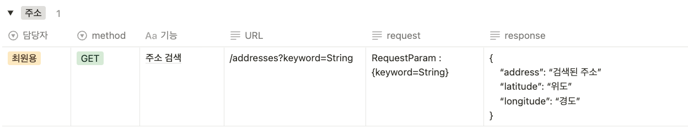
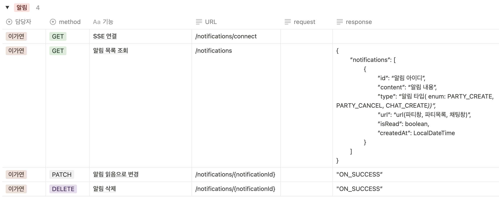
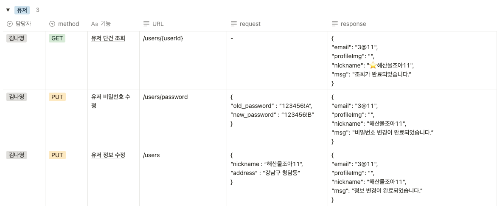
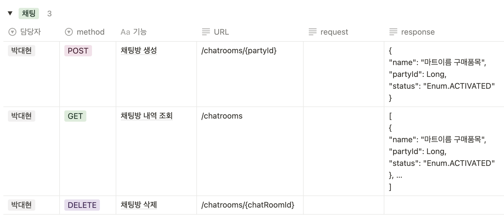
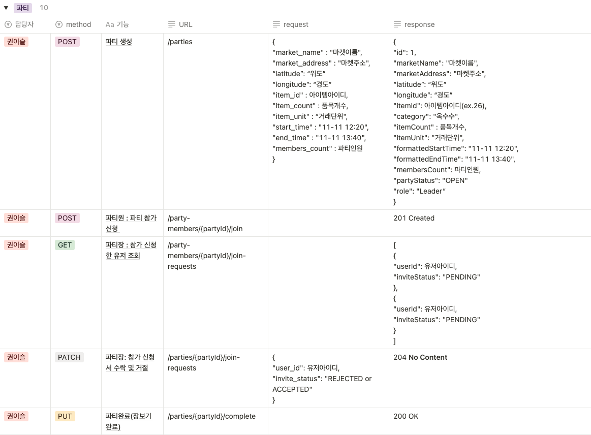
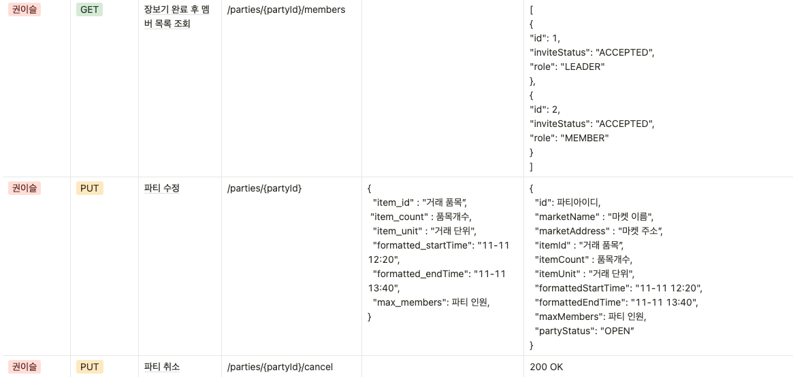
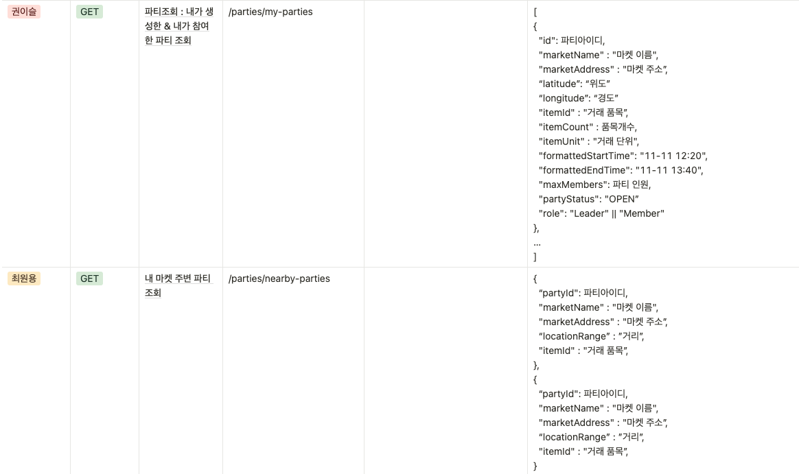
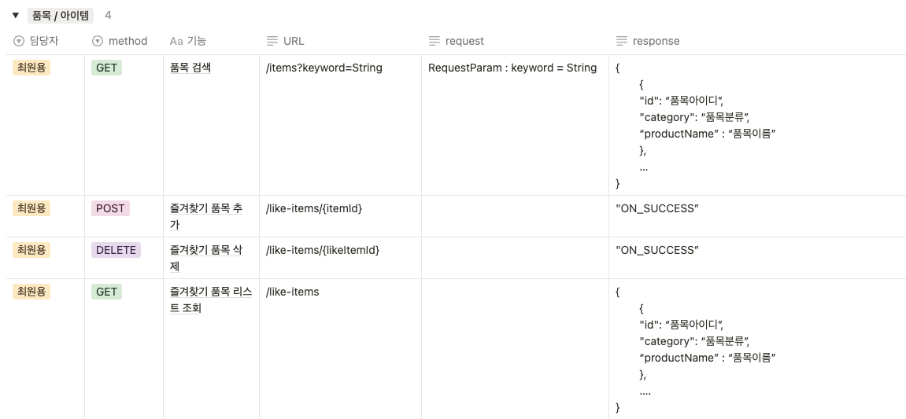
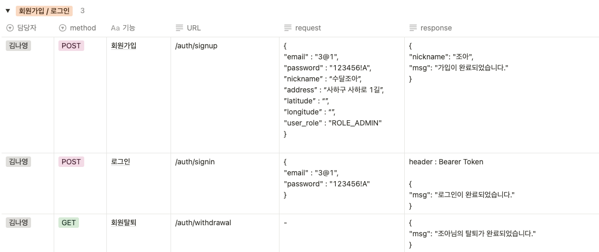

# Project 5.0.9 : 오프라인 공동 구매 플랫폼 Offline Group-Buy Platform

## 🏁 프로젝트 기획 및 소개
- 내 주변 오프라인 마트에서 물품의 공동구매를 원하는 소비자들을 모아주는 플랫폼
- 빠른 시간 내에 소량 구매를 원하는 소비자가 타겟인 서비스

## 🔑 주요 기능

> * 파티 - 공동구매를 목적으로 만들어지는 모임
> * 채팅 - 파티에 가입된 사람들끼리 실시간 채팅
> * 알림 - 유저가 찜 해 둔 특정 마켓 및 품목에 대한 알림과 파티의 생성 및 취소 알림, 채팅 생성 알림
> * 품목 - 공공데이터 API 를 사용해 품목 리스트를 생성
> * 마켓 - 실제 도로명 주소를 기반으로 위도 / 경도 데이터를 활용해 내 주변 파티의 목록과 거리를 조회
> * 패널티 - 파티의 리더는 오프라인 파티 미참석 유저에게 페널티를 부여

## 🕹️ 프로젝트 핵심기능

### 🔔 채팅
> * WebSocket 과 STOMP 를 사용하여 실시간 채팅기능 구현
> * 사용자가 채팅방 입장 시, 입장 전 오갔던 메세지 확인 가능

### 🔔 알림
> * 이벤트 발생시 SSE 를 이용하여 실시간, 지속적인 알림 기능 제공
> * 단방향 서비스를 제공하여 리소스 부담이 적고 구현이 간단

### 🔔 품목 업데이트
> * 더미 데이터가 아닌 공공데이터를 통해 실제 사용되는 품목 데이터를 이용
> * Spring Batch 와 Webclient 를 통해 데이터를 동기 방식으로 병렬 처리

## 📝 Technologies & Tools 📝

 

 

 
 
 

 

## ❓ Trouble Shooting

>### 파티
- 문제상황
  - PartyResponse 클래스에서 DateTimeFormatter 를 static 필드로 선언된 것을 발견
  - 이를 제거한 후 포스트맨에서 formatter 객체 정보까지 응답에 포함되는 문제가 발생
- 해결방안
  - DateTimeFormatter 를 생성자 내부로 이동시켜, static 필드로 선언하지 않고 생성자 내에서만 사용하는 방식으로 변경

>### JPA 쿼리메서드를 사용한 DB 조회의 성능 저하
- 문제상황
  - 유저 조회 시 해당 유저의 페널티 집계 값이 빈번하게 조회 요청이 발생함
  - 데이터베이스에서 단순하게 JPA 쿼리 메서드로 페널티 집계 값을 카운팅하기에는 속도와 성능 저하가 심함
- 해결방안
  - Redis 메모리에 유저 키와 페널티 집계 값을 캐싱, TTL - 24시간으로 설정하여 사용자 편의 개선
  - 유저 조회 요청 시에는 Redis 메모리에 저장된 유저의 페널티 집계 값을 조회함
  - 페널티 부여 시에는 Redis 메모리에 유저별로 아이디 키와 페널티 집계 값이 저장됨

>### 동시다발적인 INSERT 쿼리 요청에서 발생하는 동시성 문제 제어
- 문제상황
  - 동시에 많은 스레드에서 INSERT 쿼리 요청을 보낼 때 데이터의 정합성이 지켜지지 않을 것을 우려
  - 같은 요청의 재시도가 일어나는 상황을 예외 처리했음에도 둘 이상의 값이 카운팅됨
- 해결방안
  - Redis - Lettuce 분산 락을 이용하여 단일 서버에서 일어나는 여러 클라이언트들의 요청을 처리함
  - 효과적인 동시성 제어를 위해 타임아웃 설정을 최소로 줄여 데드락 상황을 방지함

>### WebSocket 과 Security 병합
- 문제상황
  - 채팅 기능 구현 코드를 데모 버전으로 만들었을 때 정상적으로 작동했지만, 다른 코드와 병합하면서 Security 인증 문제 발생
- 해결방안
  - WebSocket 과 STOMP 관련 경로들을 Security 설정에서 permit

>### CORS 정책 충돌
- 문제상황
  - WebSocket 에서 설정된 allowCredentials(true)로 인해, 특정 자격 증명이 있는 요청만 허용하도록 설정
  - 하지만 setAllowedOrigins("*")이 모든 자격 증명이 있는 요청을 허용하기 때문에 CORS 정책 충돌 발생
- 해결방안
  - setAllowedOriginPatterns(allowedOrigin)으로 수정함으로써, 정책 충돌 해결 및 특정 도메인 주소를 지정함으로써 보안 강화

>### 채팅 JWT인증
- 문제상황
  - 채팅 기능 사용시, Spring Security 뿐만 아니라 JWT 인증 과정도 필요함을 인지
  - HandShakerInterceptor 와 ChannelInterceptor 의 특성을 파악한 후 적절한 방법 선택이 필요
- 해결방안
  - 메세지마다 인증하는 ChannelInterceptor 방법은 현재 프로젝트 로직상 너무 인증 빈도가 높고, 성능 상의 오버헤드가 염려됨
  - 초기 연결 시 인증으로 해결할 수 있는 HandShakerInterceptor 사용으로 해결

>### API 요청 데이터 제한 & 처리지연
- 문제상황
  - API 서버에서 데이터 요청 회당 1000건 제한으로 여러 번의 요청이 필요, 직렬 동기 처리로 지연 발생
  - 데이터 파싱과 DB 저장시 처리시간 지연
  - 중복 검증 단계에 MySQL DB 접근으로 처리시간 지연
- 해결방안
  - API 요청 라이브러리 RestTemplate 에서 WebClient 로 변경하여 요청을 동기 방식에서 비동기 방식으로 변경
  - Spring Batch 도입해 데이터 파싱과 DB 저장을 청크로 묶어 병렬처리
  - 데이터 중복 확인을 위해 검색이 빠른 Hash Set 자료구조 이용

## 🎈 인프라 설계도

## 📋 ERD Diagram

## 📋 와이어프레임

## 🏆 API 명세

### 1️⃣ Address

### 2️⃣ Notification

### 3️⃣ User

### 4️⃣ Chat

### 5️⃣ Party

### 6️⃣ Penalty

### 7️⃣ Item

### 8️⃣ Auth

## 👨‍👩‍👧‍👦 팀원들 Our Team
|권이슬|김나영|박대현|이가연|최원용|
|:-:|:--:|:---:|:---:|:---:|

### 📒 팀 노션 Team Project Notion
* https://www.notion.so/teamsparta/6-93f92b3fa6bb4f04848b0c0079992349
